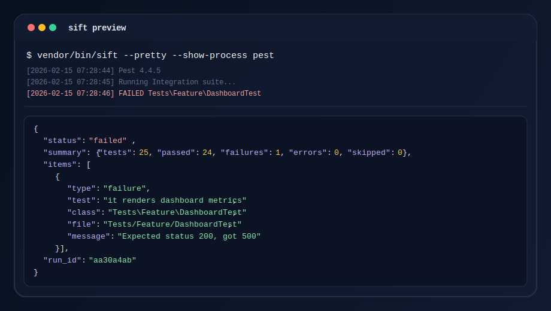

# Sift

Sift is a PHP CLI wrapper that turns tool output into compact, agent-friendly payloads.

## Current Scope

- Normalized output for `phpunit`, `pest`, `phpstan`, `phpcs`, `pint`, and `composer-audit`
- Output rendering in `json` and `markdown`
- Output sizes: `compact`, `normal`, and `fuller`
- Local run history with `sift view`
- Configurable execution policies with `defaultArgs`, `blockedArgs`, and per-tool binaries
- PHAR distribution through `composer build:phar`



## Installation

Install Sift as a development dependency:

```bash
composer require --dev vitorsreis/sift
```

Run it from the project root:

```bash
vendor/bin/sift help
```

### PHAR

Build a local PHAR:

```bash
composer build:phar
php dist/sift.phar help
```

Release installation and checksum verification are documented in [docs/RELEASE.md](docs/RELEASE.md).

## Quick Start

Initialize a config file:

```bash
vendor/bin/sift init
```

Run a tool:

```bash
vendor/bin/sift phpstan analyse src
vendor/bin/sift pest --testsuite=Integration
vendor/bin/sift composer-audit
```

Inspect a stored run:

```bash
vendor/bin/sift view list
vendor/bin/sift view <run_id> summary
vendor/bin/sift view <run_id> items --limit=10
```

## Configuration

The current `sift.json` shape is:

```json
{
  "$schema": "./resources/schema/config.schema.json",
  "history": {
    "enabled": true
  },
  "output": {
    "format": "json",
    "size": "normal",
    "pretty": false,
    "show_process": false
  },
  "tools": {
    "phpstan": {
      "enabled": true,
      "toolBinary": "vendor/bin/phpstan",
      "defaultArgs": [
        "analyse"
      ],
      "blockedArgs": []
    }
  }
}
```

See [docs/CONFIGURATION.md](docs/CONFIGURATION.md) for the full reference.

## Commands

- `sift help`
- `sift version`
- `sift init`
- `sift add <tool>`
- `sift list`
- `sift validate`
- `sift view list`
- `sift view <run_id> [summary|items|meta|artifacts|extra]`
- `sift <tool> [tool-args]`

## Documentation

- [docs/README.md](docs/README.md)
- [docs/ARCHITECTURE.md](docs/ARCHITECTURE.md)
- [docs/ADAPTERS.md](docs/ADAPTERS.md)
- [docs/CONFIGURATION.md](docs/CONFIGURATION.md)
- [docs/RELEASE.md](docs/RELEASE.md)

## Development

```bash
composer lint
composer test
composer build:phar
```

## License

Sift is released under the [MIT license](LICENSE.md).
