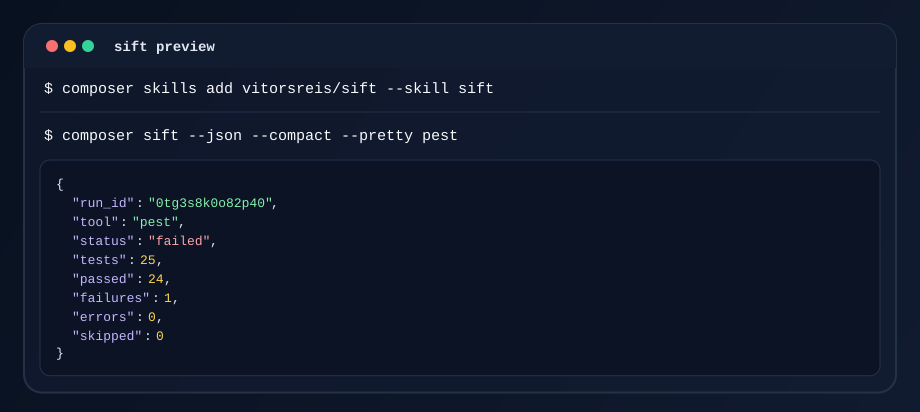

<p align="center">
    
</p>

<p align="center">
    <strong>Agent tooling and skills layer for PHP projects.</strong>
</p>

<p align="center">
    <a href="https://packagist.org/packages/vitorsreis/sift"></a>
    <a href="https://packagist.org/packages/vitorsreis/sift"></a>
    <a href="https://github.com/vitorsreis/sift/actions/workflows/ci.yml"></a>
    <a href="https://github.com/vitorsreis/sift/blob/master/LICENSE.md"></a>
</p>



---

Sift is a command layer for PHP projects that lets coding agents run tools, inspect structured results, and install reusable agent instructions without drowning the conversation in raw terminal output.

## What Sift Does

- **Runs PHP tools through one interface**: Pest, PHPUnit, Paratest, PHPStan, Psalm, PHPCS, Pint, Rector, Mago, Composer checks, and dependency tools.
- **Keeps output agent-friendly**: compact JSON first, full detail in history only when needed.
- **Installs agent skills safely**: Codex, Cursor, Claude, Copilot, Gemini, generic `AGENTS.md`, and other documented targets.
- **Blocks unsafe defaults**: read-only Composer, dry-run refactors, safe formatter modes, blocked arguments, and non-JSON machine output checks.
- **Works from every entrypoint**: Composer command, `vendor/bin/sift`, and standalone PHAR all call the same core.

## Installation

```bash
composer require --dev vitorsreis/sift
composer config allow-plugins.vitorsreis/sift true
```

PHAR releases are available from the [GitHub releases page](https://github.com/vitorsreis/sift/releases).

## Quick Start

Initialize Sift:

```bash
composer sift init
```

Inspect supported tools:

```bash
composer sift tools list
```

Run common checks:

```bash
composer sift --compact --pretty pest
composer sift --compact phpstan analyse src
composer sift --compact pint
composer sift --compact rector process --dry-run src
```

Inspect stored detail:

```bash
composer sift history list
composer sift history view <run_id>
composer sift history view <run_id> items
composer sift history view <run_id> meta
```

## Agent Skills

Install the bundled Sift skill:

```bash
composer skills add vitorsreis/sift --skill sift
composer skills list
```

Preview external skills before installing:

```bash
composer skills add owner/repo --list
composer skills add owner/repo --skill review --agent=codex --yes
composer skills update review --yes
composer skills remove review --yes
```

Accepted sources:

- `sift`: bundled Sift skill.
- `./path/to/skill`: local skill or local repository.
- `owner/repo`: GitHub shorthand.
- `https://github.com/owner/repo`: GitHub URL.

## Config Schema

`sift.json` uses `$schema` as the config contract version. `init` writes a schema URL pinned to the installed Sift version:

```json
{
  "$schema": "https://raw.githubusercontent.com/vitorsreis/sift/master/resources/schema.json",
  "output": {
    "size": "compact",
    "pretty": true,
    "show_process": true
  },
  "history": {
    "enabled": true,
    "path": ".sift/history",
    "max_files": 50,
    "max_age_days": 30,
    "max_bytes_per_run": 1048576,
    "redact_secrets": true
  },
  "tools": {
    "*": {
      "enabled": true,
      "timeout": 1800
    }
  }
}
```

## Supported Tools

- `phpunit`
- `pest`
- `paratest`
- `phpstan`
- `psalm`
- `phpcs`
- `rector`
- `pint`
- `mago`
- `infection`
- `deptrac`
- `php-cs-fixer`
- `phpmd`
- `composer-unused`
- `composer-require-checker`
- `parallel-lint`
- `composer audit|licenses|outdated|show`

## Entrypoints

```bash
composer sift <command>
composer skills <command>
php vendor/bin/sift <command>
php sift.phar <command>
```

## Documentation

- [Getting started](docs/getting-started.md)
- [CLI reference](docs/cli.md)
- [Configuration](docs/configuration.md)
- [Tools](docs/tools.md)
- [Skills](docs/skills.md)
- [Payloads](docs/payloads.md)
- [Architecture](docs/architecture.md)
- [PHAR](docs/phar.md)
- [Contributing](docs/contributing.md)

## License

Released under the [MIT license](LICENSE.md).
